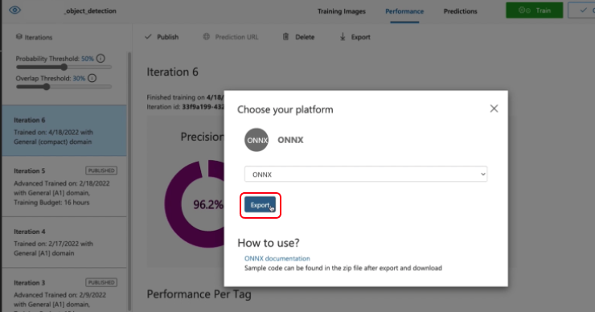
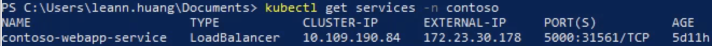

## Folder structure
This folder contains one custom pipeline to perform order accuracy video analytics tasks:

The files are structured as follows:
- `deepstream_oa.py`: the custom pipeline implementation for 8-class object detection and tracking pipeline with video input and output
- `items_tracking.py`: the custom logic using Gstreamer probes to detect items movement according to the post processing of the inference results 
- `Dockerfile`: the dockerfile of the Edge AI module 
- `configs`: contains the Deepstream configuration files such as model configurations and tracker configruations
- `streams`: contains the video to be inferenced
- `common`: contains the packages needed for deepstream python bindings

```
Edge AI App
├── deepstream_oa.py
├── items_tracking.py
├── Dockerfile
├── common
│   ├── __init__.py
│   ├── bus_call.py
│   ├── FPS.py
│   ├── is_aarch_64.py
│   └── utils.py
├── configs
│   └── pgies
│       ├── model_configs
│       │   ├── dstest2_pgie_config_oa.txt
│       │   ├── labels.txt
│       │   ├── libnvdsinfer_custom_impl_Yolo_35.so
│       │   ├── model.onnx
│       │   └── model.onnx_b1_gpu0_fp32.engine
│       └── tracker_configs
│           ├── config_tracker_NvDCF_perf.yml
│           ├── dstest2_tracker_config.txt
│           └── tracker_config.yml
└── streams
    └── Mcdonalds_receipt_v01.h264
```
## Custom pipeline structure


## Development setup
This project is based on the Deepstream 6.0 SDK and tested on an CBL-Mariner VM with NVIDIA T4 GPU

### Models(optional)
The instrcution below describe how to obtain the model files and data files in this project. **These steps are optional as these model files are already included in the repository.**

1. Create an object detection model as in [here](https://docs.microsoft.com/en-us/azure/cognitive-services/custom-vision-service/get-started-build-detector)
2. Export your model with ONNX platform
   1. Switch to the `Performance` tab
   2. Select the `Export` button that appears
      
   3. Select `ONNX`, and then `Export`
      
   4. Once the file is ready, select the `Download` button. 
   5. Open the downloaded .zip file and extract the `model.onnx`, `label.txt` file from it. This file contains your object detection model.
      
3. Put the files `model.onnx` and `label.txt` in the model_configs folder
4. Config the `dstest2_pgie_config_oa.txt`
   1. Modify that the `num-detected-classes` property maps to the number of classes or objects that you've trained your custom vision model for. 
   2. Build your custom parser library `libnvdsinfer_custom_impl_Yolo_35.so` as [here](https://github.com/leannhuang/custom-vision-parser-lib-for-nvidia-deepstream)
      1. You may be interested in modifying the [nvdsparsebbox_Yolo.cpp](https://github.com/leannhuang/custom-vision-parser-lib-for-nvidia-deepstream/blob/main/amd64/cv/nvdsparsebbox_Yolo.cpp). You can modify the Non-Maximal Suppression Threshold [kNMS_THRESH](https://github.com/leannhuang/custom-vision-parser-lib-for-nvidia-deepstream/blob/main/amd64/cv/nvdsparsebbox_Yolo.cpp#L463) and Confidence Threshold [kPROB_THRESH](https://github.com/leannhuang/custom-vision-parser-lib-for-nvidia-deepstream/blob/main/amd64/cv/nvdsparsebbox_Yolo.cpp#L464) to tune your model for better accuracy. These parameters are explained in detail in the following article.

### data(optional) **These steps are optional as the video file are already included in the repository.**
1. Transform your video file to be inferenced to h264 format and put it under streams folder
2. Modify the video file name in the Dockerfile
```shell
CMD ["python3", "deepstream_oa.py", "streams/<your video file name>.h264"] 
```

### Inter-communication between pods Edge AI App and Flask App
1. Get the service name of the namespace in your k8s cluster
```shell
kubectl get services -n <namespace>
```


2. Modify the variable [`SVC`](https://github.com/microsoft/Azure-Edge-Solutions-Lab/blob/main/Edgezone-QSR%20Demo/Edge%20AI%20App/items_tracking.py#L15) in the items_tracking.py according to the service name (ex: contoso-webapp-service) you got from the command above 
```
SVC = 'http://<your service name>'
```

## Get started
1. Build the container image by running the following command inside the Edge AI App/ directory (where the Dockerfile is located):
```shell
docker build -t edgeai .
```
2. run the container with:
```shell
docker run -it --gpus all edgeai
```

## Push the docker image to ACR or docker hub
1. Create your own Azure Container Registry [here](https://learn.microsoft.com/en-us/azure/container-registry/container-registry-get-started-portal?tabs=azure-cli) or docker hub
2. Login to your registy
    ```
    az acr login --name <registry-name>
    ```
3. Build the edge ai docker image
        
    ```
    docker build -t <registry-name>.azurecr.io/edgeai:<tag> .
    ```
4. Push your edge ai docker image to the ACR
    ```
    docker push <registry-name>.azurecr.io/edgeai:<tag>
    ```


