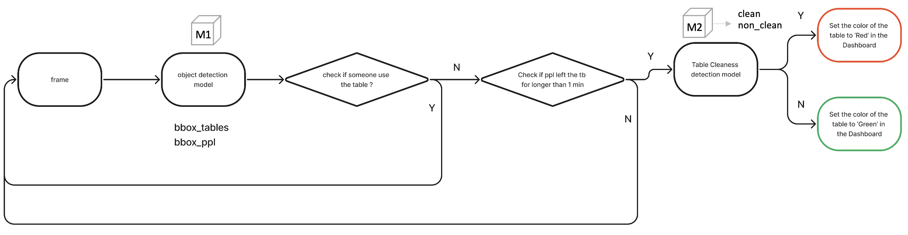
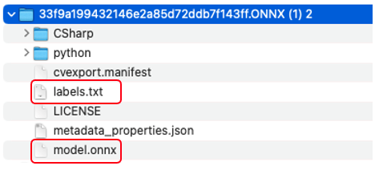

## Problem - Table Cleanliness
In the fast-food industry, maintaining clean tables is a critical factor in enhancing customer satisfaction and driving repeat business to a restaurant. However, due to the high volume of customers, restaurant employees may not have sufficient time to attend to table cleaning, which can ultimately result in a decline in customer satisfaction. 


## Solution
We provide advanced video analytics technology that delivers valuable insights on maintaining optimal cleanliness of customer dining tables. Our cutting-edge system is designed to detect any foreign objects left on a table after a customer has finished their meal. In the event of detection, our real-time dashboard promptly notifies cleaning staff, allowing them to take immediate action and clean the table promptly. 


## Directory structure

In this directory, we have provided a custom deepstream pipeline designed for video analytics tasks to ensure table cleanliness. Here is an overview of the file structure and what each file contains:
```
Edge AI App
├── deepstream_oa.py
├── tb_cleanliness_detector.py
├── Dockerfile
├── prepare_ds_triton_model_repo.sh
├── fix_output.py
├── common
│   ├── __init__.py
│   ├── bus_call.py
│   ├── FPS.py
│   ├── is_aarch_64.py
│   └── utils.py
├── configs
│   ├── model_configs
│   ├── primary_detector
│   │   ├──1
│   │   │  └── model.onnx   
│   │   ├── ds_tb_pgie_config.txt
│   │   ├── config.pbtxt
│   │   ├── labels.txt
│   │   └── libnvdsinfer_custom_impl_Yolo_md.so
│   ├── secondary_classifier
│   │   ├──1
│   │   │  └── model.onnx 
│   │   ├── config.pbtxt
│   │   ├── ds_tb_sgie_config.txt
│   │   └── labels.txt
│   └── tracker_configs
│       ├── config_tracker_NvDCF_perf.yml
│       ├── dstest2_tracker_config.txt
│       └── tracker_config.yml
└── streams
    └── IMG_1023_3.h264
```
- `deepstream_tc.py`: This file contains the implementation for a custom pipeline that performs 2-class object detection to detect people and tables, tracking, and an image classifier to detect if the table needs to be cleaned. It takes video input and produces video output.
- `tb_cleanliness_detector.py`: This file contains the custom logic that uses Gstreamer probes to detect whether the table is occupied by people and the cleanliness scenario of the table according to the metadata saved in the Gstreamer buffer.
- `prepare_ds_triton_model_repo.sh`: The script prepares the model repository by creating a folder structure for the models, copying the necessary files and directories, and converting the models to the required Triton Inference Server format. It also generates the corresponding configuration files for each model.
- `fix_output.py`: The script changes the output of the image classifier onnx model exported from Custom Vision to match what the Triton application expects to receive. We leave the Softmax node as the last node in the graph, the tensor then gets reshaped, and that becomes the final output.
- `Dockerfile`: This file contains the dockerfile for the Edge AI module.
- `configs`: This directory contains the Deepstream configuration files, such as model configurations and tracker configurations.
- `streams`: This directory contains the videos that will be used for inference.
- `common`: This directory contains the packages needed for deepstream python bindings.


## Custom Pipeline Architecture 


## Flow Chart of the Concept


## Development setup
This project is based on the Deepstream 6.2 Triton SDK and tested on an CBL-Mariner VM with NVIDIA T4 GPU

### Models(optional)
The instructions below describe how to obtain the model files and data files in this project. **These steps are optional as these model files are already included in the repository.**

1. Create an object detection model as in [here](https://docs.microsoft.com/en-us/azure/cognitive-services/custom-vision-service/get-started-build-detector)

2. Export your model with ONNX platform
   1. Switch to the `Performance` tab
   2. Select the `Export` button that appears
      
   3. Select `ONNX`, and then `Export`
      
   4. Once the file is ready, click the `Download` button. 
   5. Open the downloaded .zip file and extract the `model.onnx`, `label.txt` file from it. This file contains your object detection model.
      

3. Put `model.onnx` and `label.txt` in the model_configs folder

4. For the image classifier, run the script `fix_output.py` to do the network graph surgery to match the default Triton path's expectation 
   1. 
    ```
        pip install onnx_graphsurgeon --index-url https://pypi.ngc.nvidia.com
        python fix_output.py model.onnx model.softmaxout.onnx
    ```

   2. Renamed the reshaped model to `model.onnx` and put it in the model_configs/secondary_classifier/1/ 
   
5. Config the `ds_tb_pgie_config.txt` 
   1. Modify `num_detected_classes` property to map to the number of classes or objects that you've trained your custom vision model for. 

   2. Build your custom parser library `libnvdsinfer_custom_impl_Yolo_md.so` as [here](https://github.com/leannhuang/custom-vision-parser-lib-for-nvidia-deepstream)
      1. You may be interested in modifying the [nvdsparsebbox_Yolo.cpp](https://github.com/leannhuang/custom-vision-parser-lib-for-nvidia-deepstream/blob/main/amd64/cv/nvdsparsebbox_Yolo.cpp). If so, you can modify the Non-Maximal Suppression Threshold [kNMS_THRESH](https://github.com/leannhuang/custom-vision-parser-lib-for-nvidia-deepstream/blob/main/amd64/cv/nvdsparsebbox_Yolo.cpp#L463) and Confidence Threshold [kPROB_THRESH](https://github.com/leannhuang/custom-vision-parser-lib-for-nvidia-deepstream/blob/main/amd64/cv/nvdsparsebbox_Yolo.cpp#L464) to tune your model for better accuracy.

## Get started
1. Download the onnx model trained from Custom Vision to configs/model_configs/primiary_detector/1/
    ```
    wget https://leannazdeepstream.blob.core.windows.net/full-model/model.onnx
    ```
   
2. Download the video source file to configs/model_configs/streams/
   ```
    wget https://leannazdeepstream.blob.core.windows.net/streams/IMG_1023_3.h264
    ```
   
3. Build the container image by running the following command inside the Edge AI App/ directory (where the Dockerfile is located):
    ```shell
    docker build -t edgeai .
    ```

4. Run the container with:
    ```shell
    docker run --gpus all edgeai
    ```

5. After the entire pipeline process is completed, an inference video named "out.mp4" will be generated. To locate this video, please check it in the "edgeai" container.


   